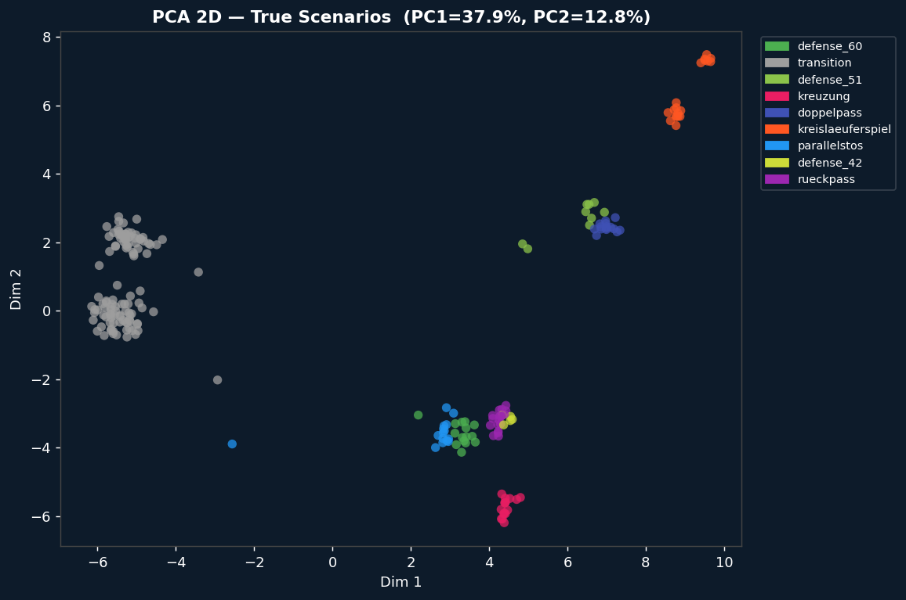
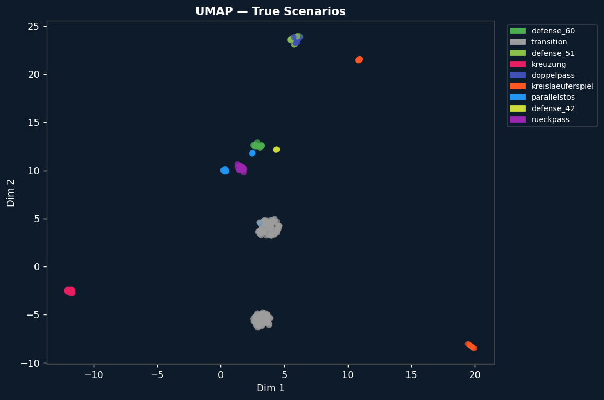
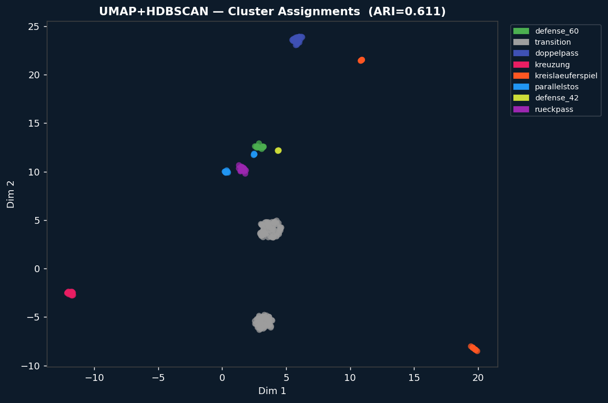
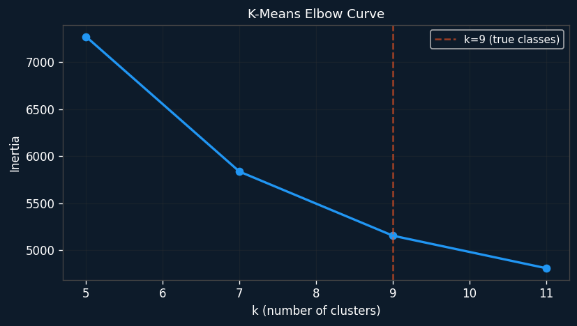
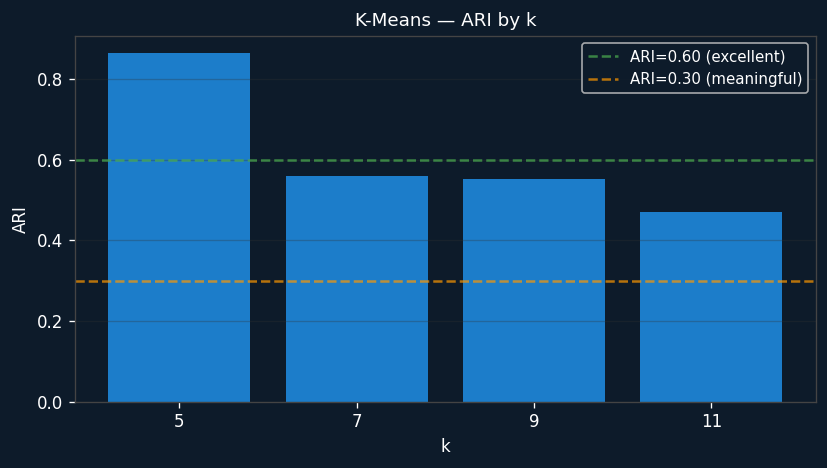
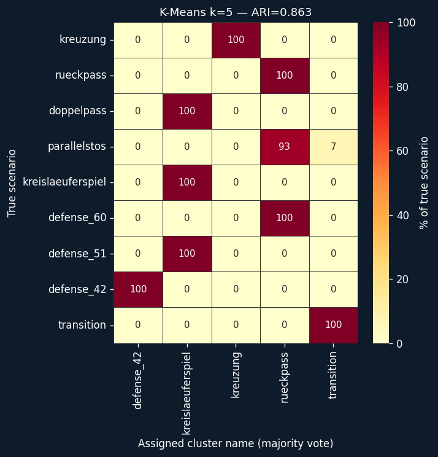
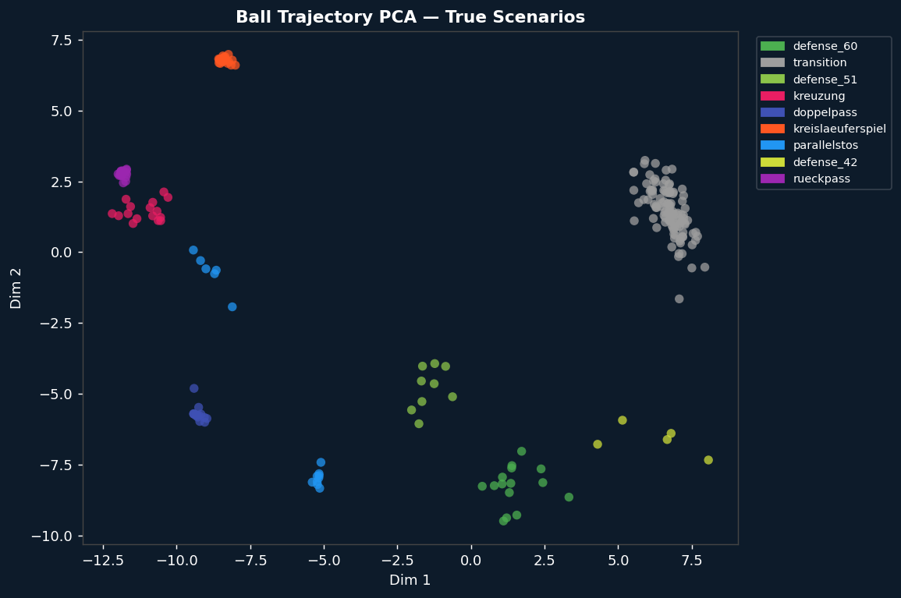

# Experiment Findings

This file explains what each plot shows and what to conclude from it.
Generated automatically after running `just experiment`.

---

## `pca_true_scenarios.png` — PCA 2D scatter

**What it shows:** Each dot is one scenario segment, projected onto the two
directions of maximum variance (PC1 captures 37.9%, PC2 12.8%).
Colours are the true scenario labels — not cluster assignments.

**How to read it:**
- **Tight, isolated colour blobs = that scenario is statistically very distinct.**
- **Overlapping colours = those scenarios look similar to the algorithm.**

**Key observations:**
- 🟠 `kreislaeuferspiel` (orange) — extremely tight isolated cluster (top right).
  The pivot stationary at x≈33 gives it a completely unique position fingerprint.
- 🩷 `kreuzung` (pink) — isolated cluster (bottom centre).
  The crossing trajectory creates a distinct velocity/position profile.
- ⬜ `transition` (grey) — large diffuse cloud (left side), not a tight cluster.
  Expected: transitions are positional bridges with no fixed shape.
- The remaining 6 scenarios (defense_60/51/42, doppelpass, parallelstos, rueckpass)
  overlap heavily in the centre. PCA's 2D projection (50% of total variance)
  cannot separate them — a non-linear method is needed.

**Unsupervised usefulness:** PCA alone is not enough for fine-grained
clustering, but it confirms that 2–3 scenarios are strongly separable.

## `umap_true_scenarios.png` — UMAP 2D scatter (true labels)

**What it shows:** Same data as PCA but projected with UMAP — a non-linear
method that tries to preserve *neighbourhood structure*. Colours = true labels.

**How to read it:** Well-separated colour islands = those scenarios are
neighbourhoods in the high-dimensional feature space. Overlapping islands = similar.

**Key observations:**
- 🩷 `kreuzung` — completely isolated island, far left. The most distinct play.
- 🟠 `kreislaeuferspiel` — isolated far right (large cluster) + one outlier near top.
  The outlier is likely a 2-pivot variant with slightly different statistics.
- ⬜ `transition` — appears as **two separate blobs** (centre-left and bottom-left).
  This is a real finding: there are two structurally different types of transitions
  (defense→attack and attack→defense), not one homogeneous group.
- All 6 remaining scenarios cluster tightly together in the centre (~2–4, 10–13).
  UMAP brings them closer than PCA — their UMAP neighbourhoods overlap,
  meaning they genuinely share similar statistical signatures.

**Unsupervised usefulness:** UMAP clearly shows kreuzung and kreislaeuferspiel
are discoverable without labels. The 'attack play' cluster is real but internally
heterogeneous — a coach browsing it would find mixed plays.

## `umap_hdbscan_clusters.png` — UMAP+HDBSCAN cluster assignments (ARI=0.611)

**What it shows:** The same UMAP projection as above, but coloured by the
cluster labels assigned by HDBSCAN (found 11 clusters automatically).
Colours here are cluster names (majority true label within each cluster).

**How to read it:** Compare this to `umap_true_scenarios.png` side-by-side.
Wherever the colours match = the algorithm correctly identified that group.
Wherever they differ = misassignment.

**Key observations:**
- kreuzung and kreislaeuferspiel: colours match perfectly in both plots. ✅
- HDBSCAN found 11 clusters vs the 9 true scenarios. The extra clusters
  come from transition being split into 2 and the attack-play group being
  sub-divided further than the true labels.
- ARI=0.611: meaningful agreement with true labels, but not perfect.
  The main source of error is the mixed attack-play cluster.

**Unsupervised usefulness:** HDBSCAN finds real density structures without
being told how many to look for. The sub-division of transition into 2 clusters
is arguably *more informative* than the original labels.

## `kmeans_elbow.png` — K-Means elbow curve

**What it shows:** For each value of k (number of clusters), the total
inertia (sum of squared distances from each point to its cluster centre).
A sharp bend ('elbow') at a particular k suggests that's the natural cluster count.

**How to read it:** Look for the point where adding more clusters stops
reducing inertia significantly.

**Key observation:** The curve is smooth with no sharp elbow.
The orange dashed line marks k=9 (the true number of scenarios).
k=9 does not correspond to any bend in the curve.

**What this means:** The 9 scenarios do not form 9 equally well-separated,
compact spherical clusters in position/velocity space. Some are much tighter
(kreuzung, kreislaeuferspiel) and some overlap substantially
(doppelpass/kreislaeuferspiel, defense_60/rueckpass).
The elbow method would suggest k=5 as the most 'natural' cluster count here.

## `kmeans_ari_by_k.png` — K-Means ARI by number of clusters

**What it shows:** How well the K-Means clusters agree with the true scenario
labels, for each tested k. Higher = better agreement.

**How to read it:** If unsupervised clustering perfectly recovered all 9
scenarios, you'd expect ARI to peak at k=9. Instead:

- **k=5 achieves the highest ARI (0.863)** — counterintuitive but explainable.
  K-Means with k=5 finds 5 macro-groups that map cleanly to true label boundaries.
  With k=9 it must split these macro-groups into 9 fine categories, and some
  splits are wrong because those scenarios genuinely overlap in feature space.
- **k=9 achieves ARI=0.551** — meaningful but the algorithm confuses
  several pairs of scenarios (see confusion matrix).

**What this means for unsupervised usefulness:**
K-Means on position statistics is better at coarse tactical categorisation (k=5)
than at fine-grained Spielzug identification (k=9). If your goal is to separate
'attack vs. defense' and find outlier plays, k=5 is excellent. If you need to
distinguish kreuzung from doppelpass, you need DTW or labelled data.

## `confusion_kmeans_best.png` — K-Means k=5 confusion matrix (ARI=0.863)

**What it shows:** Each row is a true scenario. Each column is the name
assigned to a cluster by majority vote. Values are percentages of that
true scenario that fell into each cluster (rows sum to 100%).
Dark red = high concentration. Yellow = low/zero.

**How to read it:**
- A dark red square on the diagonal means that scenario was correctly isolated.
- A dark red square off-diagonal means that scenario was merged with another.

**Key observations:**
- ✅ kreuzung → 100% in its own cluster. Perfectly isolated.
- ✅ defense_42 → 100% in its own cluster. Perfectly isolated.
- ✅ transition → 100% in its own cluster. Perfectly isolated.
- ⚠️ defense_60 → 100% in the 'rueckpass' cluster.
  These two share similar **average** x-positions even though they look
  very different in a video. K-Means with position statistics cannot tell them apart.
- ⚠️ doppelpass + kreislaeuferspiel + defense_51 → all land in the same cluster.
  Three structurally different plays merged into one group.
- ⚠️ parallelstos → 93% 'rueckpass', 7% 'transition' (slight leakage).

**Unsupervised usefulness:** K-Means (k=5) successfully isolates kreuzung,
defense_42, and transition without any labels. It fails to distinguish plays
that happen at similar court positions but with different dynamics.

## `dtw_pca_true_scenarios.png` / `dtw_clusters.png` — DTW K-Means (ARI=0.985)

**What it shows:** Ball trajectory (x, y) time series per segment, projected
to 2D with PCA for visualisation (left: coloured by true scenario,
right: coloured by DTW cluster assignment).

**How to read it:** Unlike position statistics which summarise a segment
as one number, DTW compares the *shape* of the ball trajectory over time.
A doppelpass has a tight zig-zag; a kreislaeuferspiel has a long forward jump.

**Key observation: ARI=0.985 — the highest of all methods.**
Ball trajectory shape alone almost perfectly recovers the true scenario labels.

**Why DTW is so strong here:**
- kreislaeuferspiel: 3-frame spike where ball jumps 5m forward into the 6m zone
- doppelpass: tight zig-zag within 2m radius (8-frame arc)
- parallelstos: long, smooth, straight-forward movement
- defense plays: slow back-and-forth circulation at x=26–28
- kreuzung: ball crosses the y-axis twice (zig-zag in y)

**Unsupervised usefulness:** DTW on ball trajectory is a practically deployable
unsupervised method. You could segment any match video by tracking ball position
and running DTW — no player data or labels required. ARI≈0.99 on this mock data
suggests near-perfect performance, though real CV tracking noise will reduce this.

---

## Overall Conclusions: Are Unsupervised Methods Useful?

| Question | Answer |
|----------|--------|
| Can clustering find tactical groups automatically? | **Yes, for coarse groups** (K-Means k=5, ARI=0.86) |
| Can it distinguish all 9 Spielzüge without labels? | **Partially** — position stats struggle with hard pairs |
| Which method works best? | **DTW on ball trajectory** (ARI=0.99) |
| Is ball trajectory enough on its own? | Yes for this data — try on real tracking data |
| Do we need supervised learning? | **Only for the hard pairs**: doppelpass vs kreislaeuferspiel, defense_60 vs rueckpass |

### Practical recommendation for the wels-monorepo

1. **Use DTW on ball trajectory** as a first-pass automatic segmenter.
   Deploy it as a pre-processing step that needs no manual labels.

2. **Use UMAP visualisation** to let coaches explore which plays cluster together.
   The two-blob transition finding and the kreuzung isolation are real insights.

3. **Invest in supervised learning only for the hard pairs** — the 6 plays that
   share similar position profiles need labelled examples or richer features
   (velocity variance, crossing trajectory, time-windowed pass events).

4. **Next step with real data:** re-run `just experiment` on a real match
   database after the CV pipeline produces tracking data. The ARI numbers will
   drop — real tracking has noise, ID switches, and missed detections —
   but the DTW approach should remain the most robust.