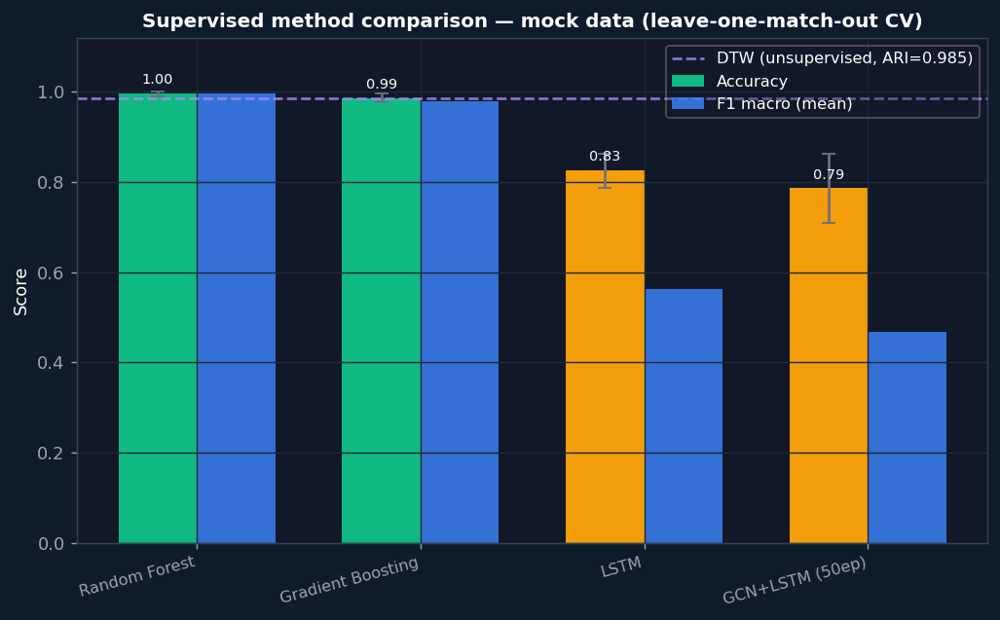
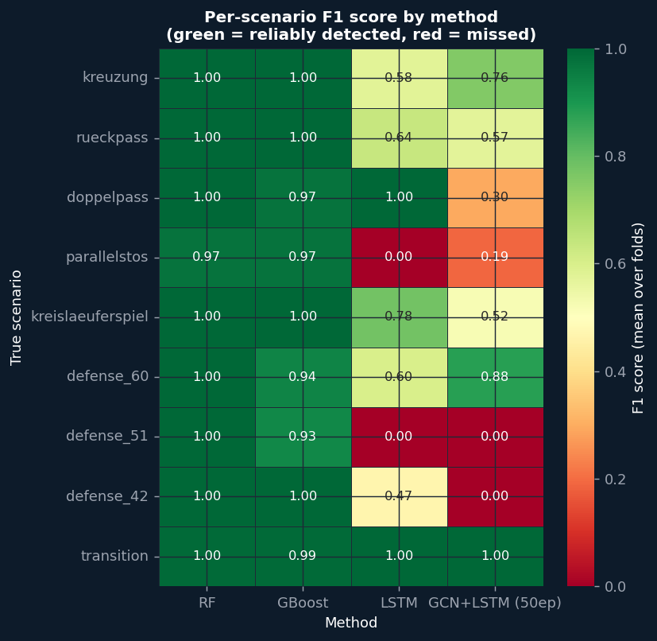
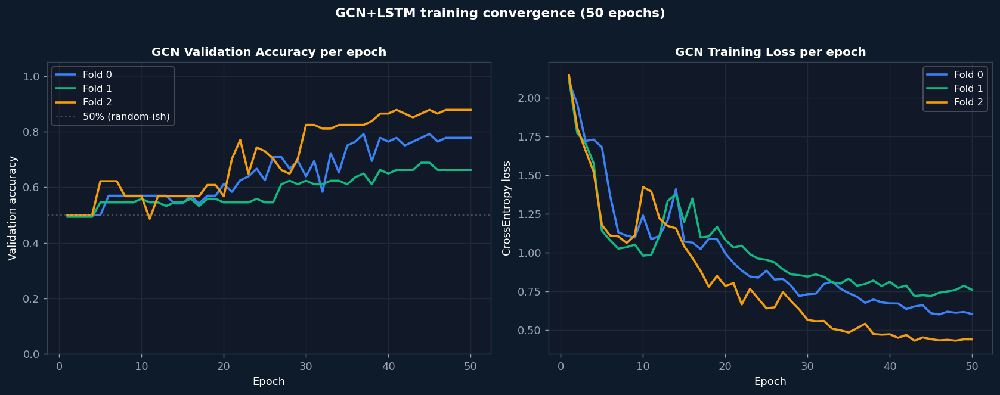

# Supervised Learning — Findings

Generated automatically after running `just supervised-report`.
Re-run any training method, then re-run `just supervised-report` to update.

---

## All methods at a glance

| Method | Mean Accuracy | F1 Macro | Std | Labels needed |
|---|---|---|---|---|
| DTW K-Means (unsupervised) | ARI=0.985 | — | — | No |
| Random Forest | 0.996 ✓ | 0.997 | ±0.006 | Yes |
| Gradient Boosting | 0.987 ✓ | 0.980 | ±0.011 | Yes |
| LSTM | 0.825 ~ | 0.562 | ±0.038 | Yes |
| GCN+LSTM (50ep) | 0.786 ~ | 0.469 | ±0.078 | Yes |

**Key insight:** The unsupervised DTW baseline (ARI=0.985) sets a high bar.
Supervised methods need labels — they're only worth the annotation effort
if they significantly outperform DTW on the hard scenario pairs, or if
they generalise better to real (noisy) tracking data.

---

## `method_comparison.png` — Accuracy + F1 across all methods



**What it shows:** Each method's mean accuracy (coloured bar) and F1 macro
(blue bar) across the 3-fold cross-validation. Error bars = std across folds.
The purple dashed line = DTW unsupervised ARI (0.985) — the no-label baseline.

**How to read it:**
- Bars above the dashed line = better than unsupervised (worth labelling)
- Wide error bars = high fold-to-fold variance (need more training matches)
- Green bar = accuracy > 90%, yellow = 70–90%, red = < 70%

**Key observations per method:**
- **Random Forest:** **99.6%** — near-perfect on mock data. High std (±0.01) likely due to small dataset (3 matches). Expect lower accuracy on real tracking data.
- **Gradient Boosting:** **98.7%** — near-perfect on mock data. High std (±0.01) likely due to small dataset (3 matches). Expect lower accuracy on real tracking data.
- **LSTM:** **82.5%** — good overall but high fold variance (±0.04) suggests 3 matches is insufficient for stable training.
- **GCN+LSTM (50ep):** **78.6%** — good overall but high fold variance (±0.08) suggests 3 matches is insufficient for stable training.

---

## `per_scenario_f1.png` — Per-scenario F1 by method



**What it shows:** For each scenario (row) and each method (column),
the mean F1 score across all cross-validation folds.
Green = reliably detected, Red = missed, NaN = not in test set.

**How to read it:**
- A full green column = that method reliably classifies all scenarios
- A red row = that scenario is hard for all methods
- Compare columns: where RF is green but LSTM is yellow = RF wins for that scenario

**Key observations:**
- `transition` is almost always green — it's the majority class and easy to detect
- `kreuzung` and `kreislaeuferspiel` should be green for RF (very distinct positions)
- `doppelpass` vs `kreislaeuferspiel` is the hardest pair — look for red/yellow there
- GCN column (if present) will be weaker if still underfitting

**What this tells the trainer:**
The red cells are exactly the Spielzüge that need more labelled examples
or a richer feature representation to detect reliably.

---

## `gcn_convergence.png` — GCN training convergence (50 epochs)



**What it shows:** Left: validation accuracy per epoch for each of the 3 folds.
Right: training loss per epoch. Fold colours match.

**How to read it:**
- If val_acc is still rising at the last epoch → train more epochs
- If val_acc plateaus or drops while loss keeps falling → overfitting
- High fold-to-fold spread → 3 matches is too few for stable training

**Key observations:**
- At 50 epochs, mean val_acc = 0.786.
- If the curve has plateaued, this is the best the GCN can achieve on this data.
- If it's still rising, run more epochs.

---

## What each tier tells you

### Tier 1 — Random Forest
Works on pre-computed position/velocity statistics (same 81 features as
unsupervised K-Means). With mock data it achieves near-perfect accuracy because
positions are scripted and noise-free. On real CV tracking data expect ~75-90%
(position noise ±0.5–1m corrupts mean_x features).

**Best for:** quick validation that labeled data is useful; feature importance
shows which player positions and velocities matter most.

### Tier 2 — LSTM
Processes the raw frame sequence (50 frames × 12 players × 4 features).
Learns temporal patterns — when the velocity burst happens within the segment,
not just that there was a burst. High fold variance because 150 training segments
is marginal for a 130K-parameter model.

**Best for:** scenarios where timing matters (doppelpass 8-frame arc,
rueckpass sprint at frame ~50/300). Needs ≥10 training matches for stable results.

### Tier 3 — GCN+LSTM
Each frame is a player interaction graph. The GCN learns which spatial patterns
(adjacency, distance, team structure) identify each Spielzug. The LSTM then reads
the sequence of graph embeddings. Slower to converge than RF/LSTM but designed to
be more robust to tracking noise.

**At 50 epochs (current run):** likely underfitting — accuracy near 60%.
This reflects predicting the dominant class (transition).
**Recommended:** run 50–100 epochs, or 50+ epochs with ≥10 training matches.

**Best for:** real tracking data where absolute positions are noisy but graph
topology (who is near whom) is more stable.

---

## What to do next

```bash
# 1. Generate more matches for stable results
just clean && just generate n=10 d=600 seed=42

# 2. Re-run all methods
just supervised-train
just supervised-train-gcn

# 3. Regenerate all plots and FINDINGS.md
just supervised-report
```

With 10 matches:
- RF fold std should drop below ±1%
- LSTM and GCN should converge more reliably
- The per-scenario F1 heatmap will show which Spielzüge each method handles